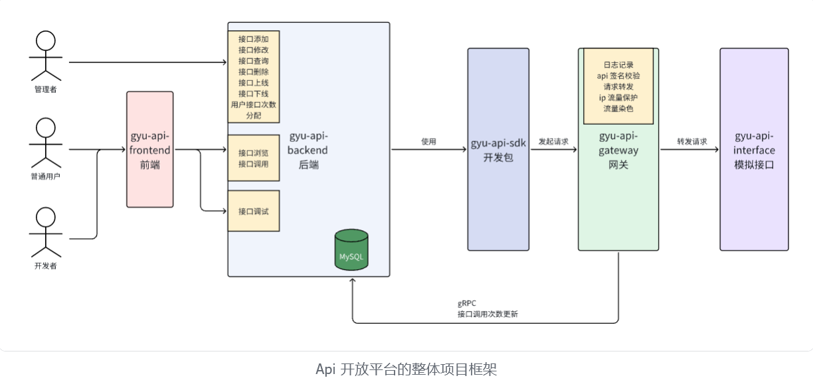
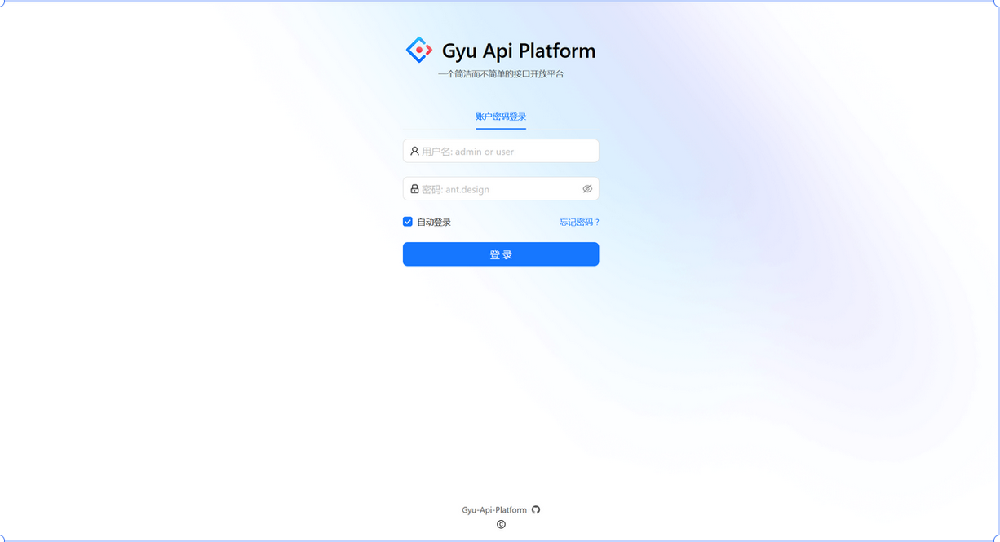
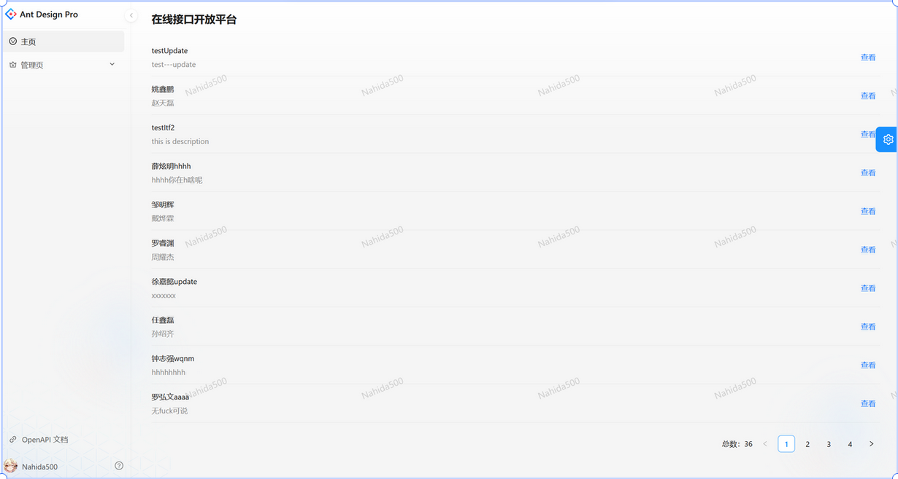
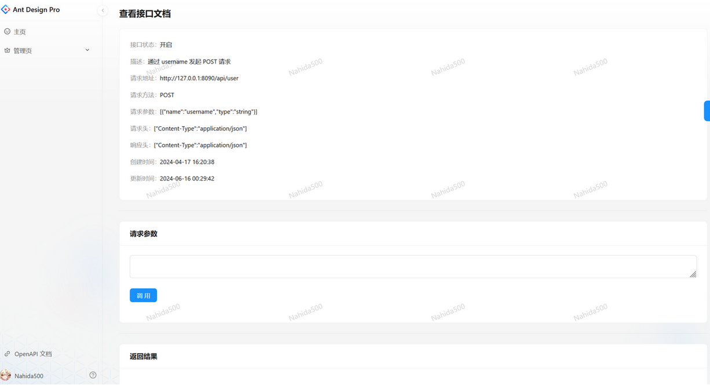
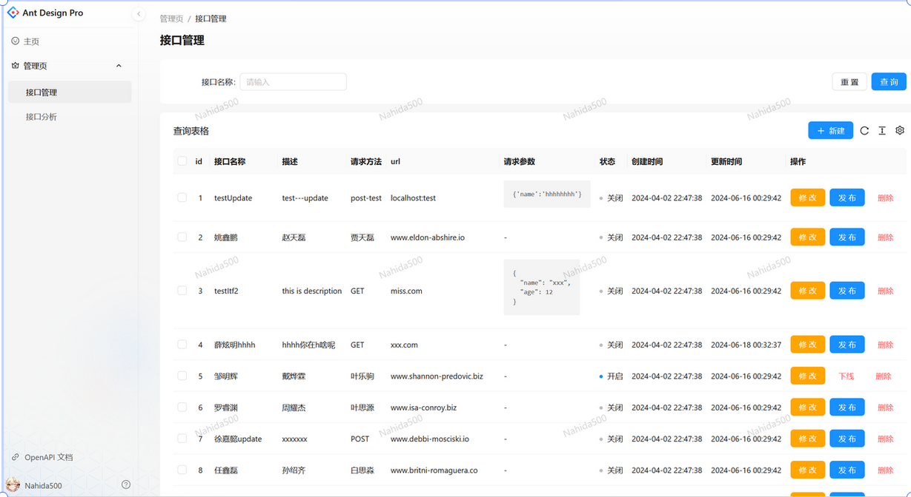
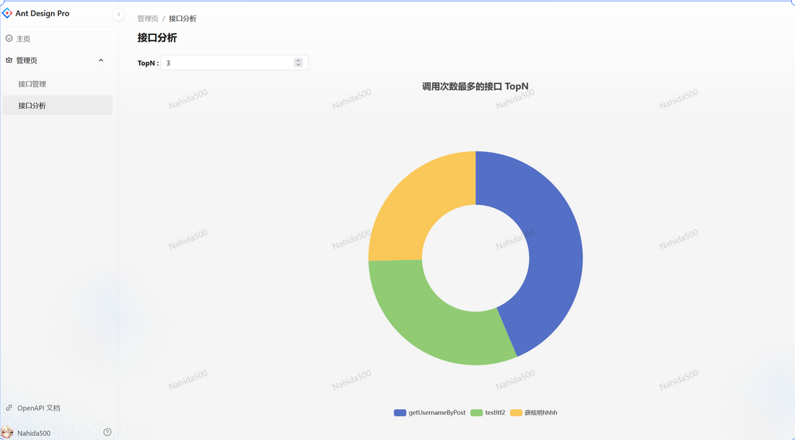

# api-open-platform

## 项目介绍
一个简洁而不简单的 api 开放平台，为开发者提供 api 接口进行在线测试、调用。  

## 项目实现的功能
本平台分别向三类用户提供相应的功能：
- 对**管理员**而言，可以对接口增删查改，对接口进行上/下线，统计分析各接口的调用情况；  
- 对**开发者**而言，可以调用平台提供的 SDK 开发包，帮助开发者轻松地在代码中调试对应接口；
- 对**普通用户**而言，注册登录平台后，可以浏览接口信息，在线调用接口。

## 技术选型
### 前端
react + Ant Design pro 脚手架 + Ant Design Pro components 组件库 + Umi 框架
### 后端
- 语言方面：go 语言 + go-zero 框架 + gRPC + gin + gorm
- 数据库：MySQL + Redis
- 算法设计：API 签名认证，令牌桶算法
- 接口文档：Swagger
- 容器化部署：Dockerfile + Docker compose

## 代码架构

本项目分为 5 个子项目：
- gyu-api-frontend：前端项目，提供给用户注册，登陆，浏览接口，调用接口的业务功能；
- gyu-api-backend：核心业务后端服务，负责用户和接口管理等核心业务功能；
- gyu-api-gateway：API 网关服务，负责集中的路由转发、统一鉴权、统一业务处理、访问控制等；
- gyu-api-sdk：客户端 SDK，封装了对 API 接口的调用方法，降低开发者的使用成本；
- gyu-api-interface：提供模拟 API 接口（属于第三方项目）。

## 项目运行预览
用户登陆注册

用户浏览 api 列表

用户浏览 api 详情，或者在线调用

管理员的 api 管理

管理员的 api 分析
